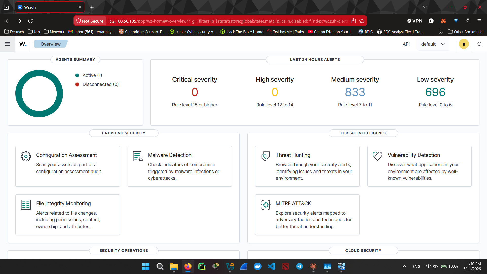
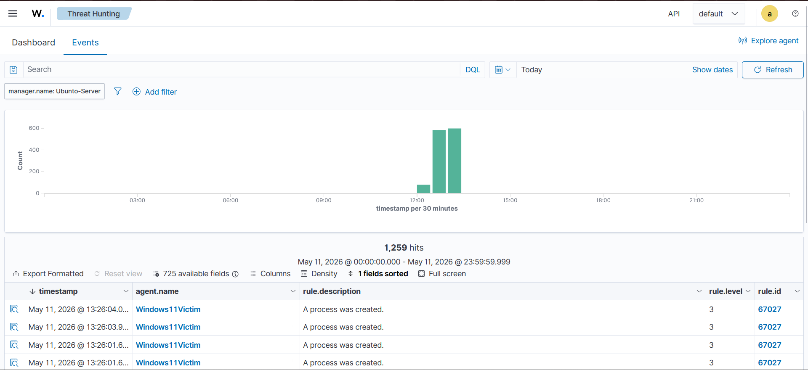
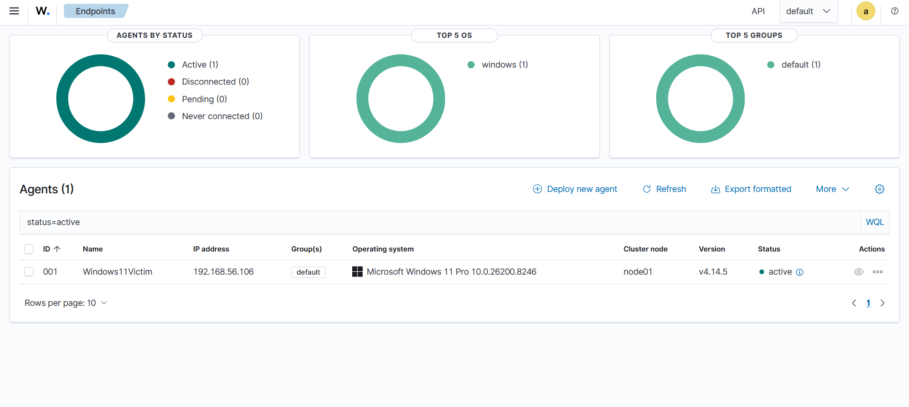

# Homelab SIEM — Wazuh-Based Threat Detection Lab


A hands-on, end-to-end Security Information and Event Management (SIEM) homelab built to simulate real-world SOC analyst workflows. This project uses **Wazuh** as the SIEM/XDR platform, with a Kali Linux attacker, Ubuntu Server as the Wazuh Manager, and a Windows 11 victim — all running as virtual machines.

> **Purpose:** Built as part of a structured cybersecurity career development path toward a junior SOC Analyst role. Demonstrates practical skills in log management, threat detection, incident triage, and security monitoring.

---

## Screenshots

| Dashboard                                              | Threat Events                                  | Agent Overview                        |
| ------------------------------------------------------ | ---------------------------------------------- | ------------------------------------- |
|  |  |  |

> See the full [`/screenshots`](./screenshots/) folder for annotated captures of each attack scenario.

---

## Repository Structure

```
homelab-siem-wazuh/
│
├── README.md                          ← You are here
│
├── screenshots/                       ← Annotated screenshots of every step
│   ├── wazuh-dashboard-overview.png
│   ├── wazuh-agent.png
│   ├── wazuh-threat-events.png
│   ├── failed-login-alert.png
│   ├── new-user-created-alert.png
│   └── ...
│
├── attack-simulations/                ← Scripts and notes per attack scenario
│   ├── brute-force/
│   │   ├── README.md
│   │   └── hydra-rdp-bruteforce.sh
│   ├── new-user-creation/
│   │   ├── README.md
│   │   └── powershell-add-user.ps1
│   └── ...
│
├── wazuh-config/                      ← Custom Wazuh rules and config files
│   ├── local_rules.xml
│   ├── ossec.conf (manager)
│   └── ossec.conf (agent)
│
├── reports/                           ← Incident reports written post-simulation
│   ├── IR-001-brute-force.md
│   ├── IR-002-new-user-creation.md
│   └── ...
│
└── docs/                              ← Architecture diagrams, notes, references
    ├── network-diagram.png
    └── lab-setup-notes.md
```

---

## Lab Architecture

```
┌─────────────────────────────────────────────────────────────┐
│                     Host Machine                            │
│                  Windows 11 (Analysis)                      │
│              Wazuh Dashboard via Browser                    │
└───────────────────────┬─────────────────────────────────────┘
                        │ Host-Only / NAT Network
          ┌─────────────┼──────────────┐
          │             │              │
  ┌───────▼──────┐ ┌────▼──────┐ ┌───▼──────────┐
  │  Kali Linux  │ │  Ubuntu   │ │  Windows 11  │
  │  (Attacker)  │ │  Server   │ │  (Victim)    │
  │              │ │  Wazuh    │ │  Wazuh Agent │
  │ 192.168.x.10 │ │  Manager  │ │ 192.168.x.30 │
  └──────────────┘ │192.168.x.20│ └──────────────┘
                   └───────────┘
```

### VM Specifications

| VM           | OS                      | Role                                | RAM  | vCPUs |
| ------------ | ----------------------- | ----------------------------------- | ---- | ----- |
| Attacker     | Kali Linux (latest)     | Simulating adversary TTPs           | 2 GB | 2     |
| SIEM Manager | Ubuntu Server 22.04 LTS | Wazuh Manager + Indexer + Dashboard | 4 GB | 2     |
| Victim       | Windows 11              | Endpoint with Wazuh Agent           | 6 GB | 4     |
| Host         | Windows 11              | Dashboard analysis, documentation   | —    | —     |

---

## Installation & Setup Guide

### Prerequisites

- VirtualBox or VMware Workstation installed on the host
- ISO images: Kali Linux, Ubuntu Server 22.04, Windows 11
- Minimum 16 GB RAM on host
- Stable internet connection for package downloads

---

### Step 1 — Network Configuration

Configure all VMs to use a **Host-Only Adapter** (or Internal Network) so they can communicate with each other and you can access the Wazuh dashboard from the host.

In VirtualBox:

- Go to **File → Host Network Manager → Create**
- Assign each VM: `Settings → Network → Adapter 1 → Host-Only Adapter`
- Optionally add **Adapter 2 → NAT** on VMs that need internet access

Assign static IPs or note the DHCP-assigned IPs for each VM.

---

### Step 2 — Install Wazuh Manager on Ubuntu Server

SSH into the Ubuntu Server VM or use the terminal directly.

```bash
# Update the system
sudo apt-get update && sudo apt-get upgrade -y

# Download and run the Wazuh all-in-one installer
curl -sO https://packages.wazuh.com/4.x/wazuh-install.sh
curl -sO https://packages.wazuh.com/4.x/config.yml
```

Edit `config.yml` to set your node names and IP addresses:

```yaml
nodes:
  indexer:
    - name: node-1
      ip: "<UBUNTU_SERVER_IP>"
  server:
    - name: wazuh-1
      ip: "<UBUNTU_SERVER_IP>"
  dashboard:
    - name: dashboard
      ip: "<UBUNTU_SERVER_IP>"
```

Then run the installer:

```bash
sudo bash wazuh-install.sh -a
```

> Save the admin credentials printed at the end of the install — you will need them to log into the dashboard.

Verify services are running:

```bash
sudo systemctl status wazuh-manager
sudo systemctl status wazuh-indexer
sudo systemctl status wazuh-dashboard
```

Access the Wazuh dashboard from your host browser:

```
https://<UBUNTU_SERVER_IP>:443
Username: admin
Password: <generated password>
```

---

### Step 3 — Install Wazuh Agent on Windows 11 (Victim)

1. On the Wazuh dashboard, go to **Agents → Deploy new agent**
2. Select **Windows** as the OS
3. Enter the **Wazuh Manager IP** (Ubuntu Server IP)
4. Copy the generated PowerShell command and run it on the Windows 11 VM as Administrator:

```powershell
Invoke-WebRequest -Uri https://packages.wazuh.com/4.x/windows/wazuh-agent-4.x.x-1.msi `
  -OutFile wazuh-agent.msi; `
  Start-Process msiexec.exe -ArgumentList '/i wazuh-agent.msi /q `
  WAZUH_MANAGER="<MANAGER_IP>" WAZUH_AGENT_NAME="win11-victim"' -Wait; `
  NET START WazuhSvc
```

Verify the agent is connected:

- On the Windows VM: check Services for **WazuhSvc** (Running)
- On the dashboard: **Agents → Active** should show your Windows agent

---

### Step 4 — Configure Wazuh for Enhanced Windows Monitoring

Edit the Wazuh agent config on the Windows VM at:
`C:\Program Files (x86)\ossec-agent\ossec.conf`

Add the following to enable Sysmon and Windows Event Log monitoring:

```xml
<ossec_config>
  <localfile>
    <location>Security</location>
    <log_format>eventchannel</log_format>
  </localfile>
  <localfile>
    <location>System</location>
    <log_format>eventchannel</log_format>
  </localfile>
  <localfile>
    <location>Microsoft-Windows-Sysmon/Operational</location>
    <log_format>eventchannel</log_format>
  </localfile>
</ossec_config>
```

Restart the agent after changes:

```powershell
NET STOP WazuhSvc && NET START WazuhSvc
```

> **Recommended:** Install [Sysmon](https://learn.microsoft.com/en-us/sysinternals/downloads/sysmon) on the Windows VM using the [SwiftOnSecurity config](https://github.com/SwiftOnSecurity/sysmon-config) for significantly richer telemetry.

---

### Step 5 — Kali Linux Setup (Attacker)

The Kali VM is used to simulate attacks. No special configuration is needed beyond ensuring network connectivity to the Windows 11 victim.

Confirm connectivity:

```bash
ping <WINDOWS_11_IP>
nmap -sV <WINDOWS_11_IP>
```

Key tools used in this lab (pre-installed on Kali):

- `hydra` — brute-force credential attacks
- `nmap` — network scanning and enumeration
- `metasploit` — exploitation framework
- `evil-winrm` — Windows remote management post-exploitation
- `crackmapexec` — SMB/AD enumeration

---

## Attack Simulations & Detections

Each simulation below was executed from Kali Linux against the Windows 11 victim. Resulting alerts were triaged in the Wazuh dashboard.

---

### Simulation 1 — Brute Force / Failed Login Attempts

**Objective:** Trigger Wazuh's failed authentication detection by simulating a credential brute-force attack over RDP or SMB.

**Execution (Kali):**

```bash
# RDP brute force with Hydra
hydra -l administrator -P /usr/share/wordlists/rockyou.txt rdp://<WINDOWS_11_IP>

# Or SMB brute force
hydra -l administrator -P /usr/share/wordlists/rockyou.txt smb://<WINDOWS_11_IP>
```

**What Wazuh Detected:**

- Rule **60122** — Multiple Windows logon failures
- Rule **18152** — Possible attack detected (multiple authentication failures)
- Windows Event IDs: **4625** (Failed logon), **4776** (Credential validation failure)

**Screenshot:** 

[`screenshots/failed-login-alert.png`](./screenshots/failed-login-alert.png)
[`screenshots/failed-login-alert2.png`](./screenshots/failed-login-alert2.png)

**Key Observations:**

- Wazuh aggregated multiple 4625 events and escalated the alert level
- Source IP from the Kali machine was clearly visible in the alert details
- Timeline view showed the spike in login failures within seconds

---

### Simulation 2 — New Local User Created

**Objective:** Detect privilege escalation or persistence via new user account creation on the victim machine.

**Execution (Windows 11 victim — simulating attacker post-exploitation):**

```powershell
# Create a new local user
net user backdooruser Password123! /add

# Add to local administrators group
net localgroup administrators backdooruser /add
```

**What Wazuh Detected:**

- Rule **60106** — Windows user account created
- Rule **60109** — User added to local administrators group
- Windows Event IDs: **4720** (User account created), **4732** (Member added to security group)

**Screenshot:**

[`screenshots/new-user-created-alert.png`](./screenshots/new-user-created-alert.png)
[`screenshots/new-user-created-alert-threat-events.png`](./screenshots/new-user-created-alert-threat-events.png)


**Key Observations:**

- Alert fired within seconds of account creation
- Event details included the username, the account that performed the action, and the timestamp
- The privilege escalation (adding to admins) generated a separate, higher-severity alert

---

### Simulation 3 — Network Reconnaissance (Nmap Scan)

**Objective:** Detect port scanning activity against the victim.

**Execution (Kali):**

```bash
nmap -sS -sV -O -p- <WINDOWS_11_IP>
```

**What Wazuh Detected:**

- Firewall/IDS rules flagged repeated connection attempts across multiple ports
- Windows Firewall logs (if forwarded) show the scan pattern

---

## Wazuh Dashboard Walkthrough

### Dashboard Overview

The main dashboard provides a real-time summary of:

- Total alerts by severity level (critical, high, medium, low)
- Top attacking sources (IP addresses)
- Most triggered rule IDs
- Security events timeline

**Screenshot:** [`screenshots/wazuh-dashboard-overview.png`](./screenshots/wazuh-dashboard-overview.png)

### Agent Management

The Agents section shows all enrolled endpoints with:

- Connection status (Active / Disconnected)
- Last keep-alive timestamp
- OS version and agent version
- Groups assigned

**Screenshot:** [`screenshots/wazuh-agent.png`](./screenshots/wazuh-agent.png)

### Threat Intelligence Events

The Security Events module allows filtering by:

- Rule ID, Rule group, Rule level
- Agent name
- Time range
- MITRE ATT&CK technique

**Screenshot:** [`screenshots/wazuh-threat-events.png`](./screenshots/wazuh-threat-events.png)

---

## MITRE ATT&CK Mapping

| Simulation                | MITRE Tactic         | MITRE Technique               | Technique ID |
| ------------------------- | -------------------- | ----------------------------- | ------------ |
| Brute Force Login         | Credential Access    | Brute Force                   | T1110        |
| New User Created          | Persistence          | Create Account: Local Account | T1136.001    |
| User Added to Admin Group | Privilege Escalation | Valid Accounts                | T1078        |
| Nmap Scan                 | Discovery            | Network Service Discovery     | T1046        |

---

## Planned Expansions (Roadmap)

### Phase 2 — Detection Engineering
- [✅] Write custom Wazuh rules in `local_rules.xml` for lab-specific scenarios
- [✅] Tune alert thresholds to reduce false positives
- [✅] Map all custom rules to MITRE ATT&CK IDs
- [✅] Test PowerShell script block logging detection

### Phase 3 — Advanced Attack Scenarios
- [ ] Simulate credential dumping (Mimikatz/LSASS) and detect with Sysmon
- [ ] Simulate lateral movement via PsExec and detect with Wazuh

### Phase 4 — Threat Intelligence
- [ ] Integrate VirusTotal API for automatic IoC enrichment on alerts

### Phase 5 — Hardening & Compliance
- [ ] Run Wazuh SCA against CIS Benchmarks on Windows 11 victim
- [ ] Document findings and remediation steps

### Phase 6 — Reporting
- [ ] Write structured incident reports for each simulation
- [ ] Build one custom dashboard showing SOC metrics (alert volume, top rules, MITRE coverage)

---

## SOC Analyst Career Relevance

This project directly maps to the core responsibilities of a **Tier 1 / Junior SOC Analyst** role:

| SOC Skill              | How This Lab Demonstrates It                                            |
| ---------------------- | ----------------------------------------------------------------------- |
| Alert triage           | Reviewing and categorizing Wazuh alerts by severity and rule            |
| Log analysis           | Parsing Windows Event Logs (4625, 4720, 4732, etc.) via Wazuh           |
| Threat detection       | Identifying brute force, privilege escalation, and persistence patterns |
| Incident documentation | Writing structured incident reports per simulation                      |
| Tool proficiency       | Wazuh, OpenSearch Dashboards, Sysmon, Kali toolset                      |
| MITRE ATT&CK           | Mapping detected behaviors to the framework                             |
| Network awareness      | Understanding attacker–victim traffic in a segmented VM network         |
| Custom rule writing    | Developing detection content in Wazuh rule XML                          |

---

## Tools & Technologies

| Category           | Tool / Technology                               |
| ------------------ | ----------------------------------------------- |
| SIEM / XDR         | Wazuh 4.14                                      |
| Log Indexing       | OpenSearch (Wazuh Indexer)                      |
| Visualization      | OpenSearch Dashboards                           |
| Attacker OS        | Kali Linux                                      |
| Victim OS          | Windows 11                                      |
| Server OS          | Ubuntu Server 26.04 LTS                         |
| Virtualization     | VirtualBox / VMware Workstation                 |
| Endpoint Telemetry | Sysmon (SwiftOnSecurity config)                 |
| Attack Tools       | Hydra, Nmap, Metasploit, Mimikatz (isolated VM) |

---

## References & Learning Resources

- [Wazuh Official Documentation](https://documentation.wazuh.com/)
- [Wazuh GitHub Repository](https://github.com/wazuh/wazuh)
- [MITRE ATT&CK Framework](https://attack.mitre.org/)
- [SwiftOnSecurity Sysmon Config](https://github.com/SwiftOnSecurity/sysmon-config)
- [Windows Security Event IDs Reference](https://www.ultimatewindowssecurity.com/securitylog/encyclopedia/)
- [HackTheBox SOC Analyst Path](https://app.hackthebox.com/tracks)

---

## 📄 License

This project is licensed under the MIT License — see the [LICENSE](LICENSE) file for details.

---

## 👤 Author

**Erfan Nayeb Aghaei** — Junior SOC Analyst  
[LinkedIn](https://www.linkedin.com/in/erfan-nayeb-aghaei/) · [GitHub](https://github.com/erfannayeb)
